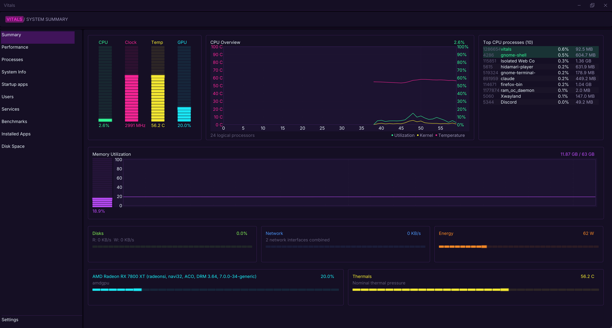
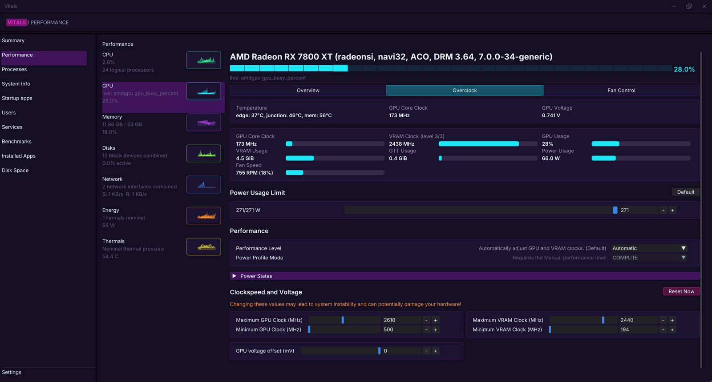
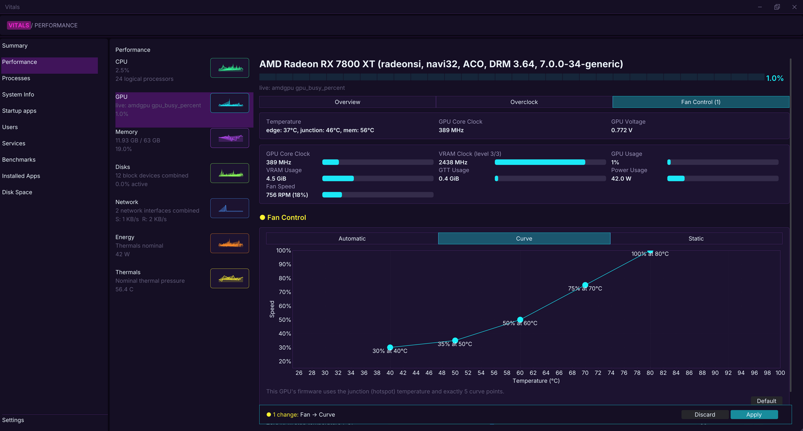
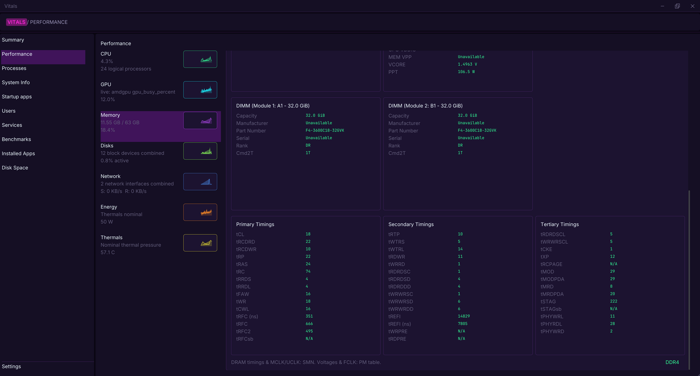
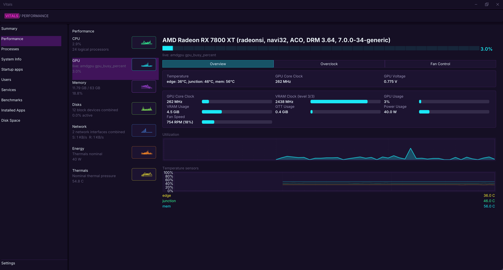
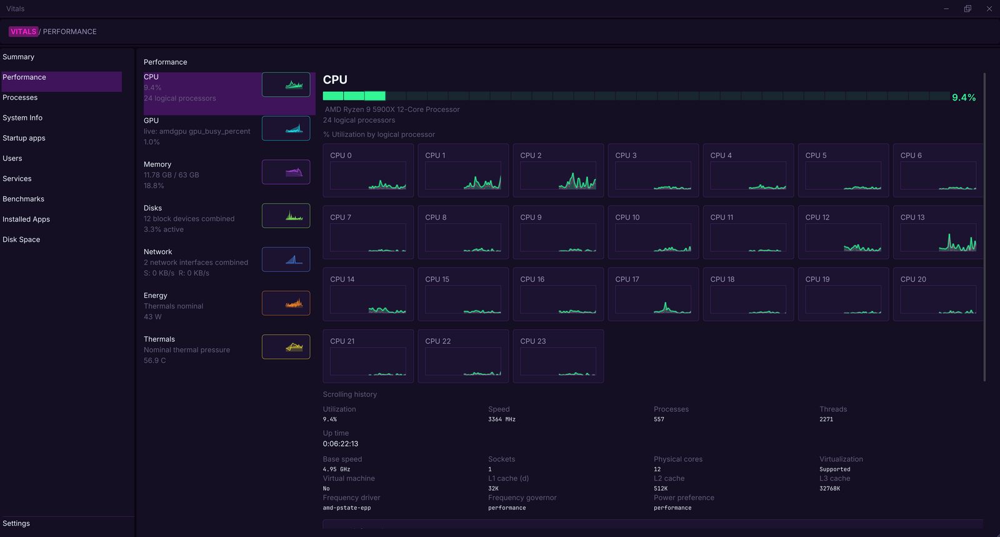
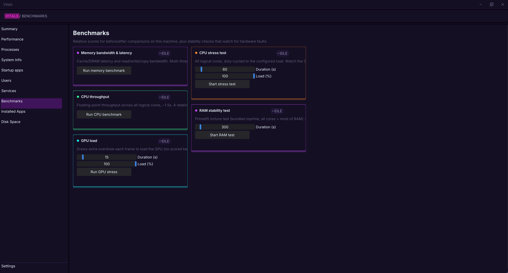
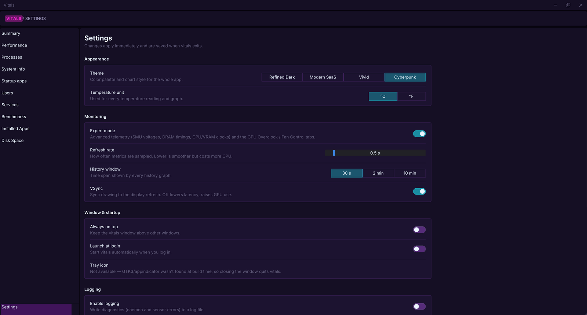

# vitals

A fast, good-looking **system monitor and task manager for Linux** — think Windows Task Manager / HWiNFO — built with Dear ImGui + ImPlot. Out of the box it's a plain, unprivileged task manager. Switch on **Expert mode** and it becomes a tuning tool: deep CPU/RAM telemetry and **GPU overclocking and fan control** in the style of [LACT](https://github.com/ilya-zlobintsev/LACT).



## Features

**Monitoring**
- **Summary** — CPU, clock, temperature, GPU meters, CPU/memory history, top processes, disks, network, energy, thermals at a glance
- **Performance** — detail pages for CPU (per-core), memory, disks, network, energy, thermals and GPU, each with live history graphs
- **Processes** — sortable table with CPU/memory/GPU usage; start / stop / terminate / kill
- **System Info, Users, Services, Startup apps, Installed Apps, Disk Space**
- **Benchmarks** — memory bandwidth & latency, CPU throughput, GPU load, CPU stress test (configurable load and duration), RAM stability test (Prime95)
- Themes (Refined Dark, Modern SaaS, Vivid, Cyberpunk), °C/°F, adjustable refresh rate and history window, tray icon

**Expert mode** (Settings → Monitoring)
- **RAM timings** — the live primary (tCL, tRCD, tRP, tRAS, tRC, tRFC …), secondary (tRTP, tWTR, tRDWR, tWRRD, tREFI …) and tertiary (tRDRDSCL, tWRWRSCL, tCKE, tMOD, tSTAG, tPHY* …) timings straight from the memory controller, plus Cmd2T, GDM and power-down mode — like ZenTimings, on Linux
- DIMM details per slot (capacity, part number, rank) and SPD temperatures
- AMD SMU telemetry: core/SoC/memory voltages, PPT, FCLK/UCLK/MCLK, per-CCD temperatures
- Per-sensor GPU temperature graphs

**Overclocking (Expert mode → Performance → GPU)**
- **Overclock tab:** power limit, performance level, power profile mode, power states, min/max GPU and VRAM clocks, GPU voltage offset (AMD); clock offsets and voltage boost (Nvidia)
- **Fan Control tab:** *Automatic* (firmware target temperature, acoustic limit/target, minimum speed, zero-RPM), *Curve* (drag-and-drop fan curve) and *Static* speed
- Every slider starts at the card's **real current value**; edited values are highlighted, and a changes bar lists exactly what will be applied
- **Safe apply:** each change must be confirmed within 10 s or it reverts automatically, so a bad clock can't leave the system unusable; confirmed settings are re-applied at every boot
- Supports AMD (amdgpu sysfs, incl. RDNA3 firmware fan curves) and Nvidia (NVML; experimental NvAPI voltage/VF-curve)

## Screenshots

### GPU overclocking (Expert mode)
Power limit, performance level, power profile, power states, GPU/VRAM clocks and voltage offset — every value starts at the card's real current setting.



### Fan control (Expert mode)
Automatic, curve or static. Drag the curve points; the bar at the bottom lists every pending change before you apply it, and an unconfirmed change reverts after 10 s.



### RAM timings (Expert mode)
Primary, secondary and tertiary DRAM timings, DIMM details and SMU voltages, read live from the memory controller.



### GPU overview
Live core/VRAM clocks, VRAM and GTT usage, power, fan speed and all GPU temperatures.



### CPU
Per-core load, clocks and history.



### Benchmarks
Memory bandwidth & latency, CPU throughput, GPU load, CPU stress test and Prime95 RAM stability test.



### Settings
Appearance, monitoring options, startup, logging, and the status and on/off commands for the daemons.



## How it's put together

| Binary | Runs as | Purpose |
|---|---|---|
| `vitals` | your user | The GUI. Never elevates itself or starts anything on its own. |
| `ram_oc_daemon` (`vitals-ramocd` service) | root | DRAM/SMU telemetry and the memory benchmark, over shared memory + a Unix socket. GPLv3, kept as a separate process so `vitals` doesn't link GPL code. |
| `gpu_ctl_daemon` (`vitals-gpud` service) | root | Applies GPU settings for the Overclock / Fan Control tabs. Port of LACT's control logic. |

Both daemons are optional.

## Build & Run

### 1. Install build dependencies

Debian / Ubuntu:

```sh
sudo apt install build-essential cmake git pkg-config \
    libgl-dev libx11-dev libxrandr-dev libxinerama-dev libxcursor-dev libxi-dev \
    libwayland-dev libwayland-bin libxkbcommon-dev wayland-protocols

# optional, for the tray icon:
sudo apt install libgtk-3-dev libayatana-appindicator3-dev
```

You need CMake ≥ 3.20, a C++17 compiler and an OpenGL 3.3 driver. GLFW, Dear ImGui, ImPlot and tray are downloaded automatically by CMake on the first build (needs `git` and internet once).

### 2. Build

```sh
git clone <this repo> vitals && cd vitals
cmake -B build -DCMAKE_BUILD_TYPE=Release
cmake --build build -j
```

Result in `build/`: `vitals` (the app), `ram_oc_daemon` and `gpu_ctl_daemon` (the optional daemons).

### 3. Run

```sh
./build/vitals
```

That's the complete task manager — no root and no daemons needed.

### 4. Enable the daemons (optional, one time)

For RAM/SMU telemetry, the memory benchmark and GPU overclocking / fan control, install the two daemons once. Like LACT's `lactd`, they then start at every boot until you turn them off:

```sh
sudo scripts/install-daemons.sh             # installs, starts and enables vitals-ramocd + vitals-gpud
                                            # (adds you to the vitals-gpu group — log out and back in once)
```

Then open **Settings → Expert mode** to get the Overclock and Fan Control tabs. **Settings → Daemons** shows each daemon's status.

```sh
sudo systemctl disable --now vitals-ramocd  # turn a daemon off (or vitals-gpud) ...
sudo systemctl enable  --now vitals-ramocd  # ... and back on
sudo scripts/install-daemons.sh             # after a rebuild: update the installed daemons
```

> Run either vitals-gpud **or** LACT, not both — they write the same GPU settings: `sudo systemctl disable --now lactd`

## Install as .deb packages

### 1. Create the packages

After building (steps 1–2 above):

```sh
cd build
cpack
```

This creates two packages in `build/`:

| Package | Contains |
|---|---|
| `vitals_1.0.0_amd64.deb` | the app, desktop entries (normal + "vitals (root)"), icon, fonts, and the `vitals-ramocd` service |
| `vitals-gpud_1.0.0_amd64.deb` | the optional `vitals-gpud` GPU-control service (depends on `vitals`) |

### 2. Install them

```sh
sudo apt install ./vitals_1.0.0_amd64.deb          # app — then start "vitals" from your app menu
sudo apt install ./vitals-gpud_1.0.0_amd64.deb     # optional: GPU overclocking / fan control
```

Use `apt install ./…deb` rather than `dpkg -i`, so dependencies (`pkexec`) are resolved.

### 3. Enable the daemons (one time)

Packages install the services but never start them by themselves:

```sh
sudo systemctl enable --now vitals-ramocd vitals-gpud
sudo usermod -aG vitals-gpu $USER                   # then log out and back in once
```

### Update or remove

```sh
# after code changes: rebuild, repackage, reinstall
cmake --build build && (cd build && rm -f *.deb && cpack)
sudo apt install --reinstall ./build/vitals_1.0.0_amd64.deb ./build/vitals-gpud_1.0.0_amd64.deb

# uninstall (services are stopped and disabled automatically)
sudo apt remove vitals-gpud vitals
```

`--reinstall` is needed because the version number doesn't change between rebuilds; bump `CPACK_PACKAGE_VERSION` in `CMakeLists.txt` for normal upgrades instead.

## Notes

- **Running the GUI as root on Wayland:** plain `sudo` strips `XDG_RUNTIME_DIR`/`WAYLAND_DISPLAY` — use `sudo -E ./build/vitals`. (Not needed when the daemons are installed.)
- **SMU voltages / DRAM timings** need the `ryzen_smu` kernel module on AMD Ryzen.
- **DRAM voltage on NCT6687D boards** (many recent MSI/ASUS/Gigabyte): install [`nct6687d`](https://github.com/Fred78290/nct6687d) via DKMS and `sudo modprobe nct6687`; vitals reads its `DRAM` channel directly.
- **AMD GPU overclocking** requires overdrive to be enabled (`amdgpu.ppfeaturemask` kernel parameter).
- **VRAM always at its top clock?** With several high-resolution or high-refresh monitors, amdgpu keeps VRAM at its highest level on purpose — not a reading error.
- **Self-check** for the GPU daemon's parsers: `cmake --build build --target gpuctl_check && ./build/gpuctl_check`

## Third-party software & credits

| Software | Used for | License |
|---|---|---|
| [Dear ImGui](https://github.com/ocornut/imgui) | GUI toolkit | MIT |
| [ImPlot](https://github.com/epezent/implot) | Graphs and the fan-curve editor | MIT |
| [GLFW](https://github.com/glfw/glfw) | Window, OpenGL context, input | zlib |
| [tray](https://github.com/zserge/tray) | System tray icon | MIT |
| **TuxTimings** (vendored in `ram_oc/`) | AMD SMU / PM-table telemetry, DRAM timings, memory benchmark — compiled only into `ram_oc_daemon` | GPLv3 — [`ram_oc/LICENSE`](ram_oc/LICENSE) |
| [LACT](https://github.com/ilya-zlobintsev/LACT) by Ilya Zlobintsev | `gpu_ctl_daemon` ports LACT's GPU control approach: confirm/auto-revert timer, AMD overdrive & PMFW fan handling, and its reverse-engineered Nvidia NvAPI calls | MIT — [`gpu_ctl_daemon/LICENSE-LACT`](gpu_ctl_daemon/LICENSE-LACT) |
| [Prime95 / mprime](https://www.mersenne.org/) v30.19 (bundled in `oc/`) | RAM stability test | GIMPS license — [`oc/p95v3019b20.linux64/license.txt`](oc/p95v3019b20.linux64/license.txt) |
| [Inter](https://rsms.me/inter/), [JetBrains Mono](https://www.jetbrains.com/lp/mono/) | UI and monospace fonts | SIL OFL 1.1 — [`assets/fonts/`](assets/fonts/) |

Optional system components used when present (not bundled): `ryzen_smu` kernel module, `nct6687d` kernel module, AMD `amdgpu` sysfs interfaces, Nvidia NVML (`libnvidia-ml.so.1`) and NvAPI (`libnvidia-api.so.1`).

## Compatibility

| Feature | AMD Ryzen + AMD GPU | Nvidia GPU | Intel CPU / GPU |
|---|---|---|---|
| Task manager & monitoring | ✅ | ✅ | ✅ |
| Benchmarks | ✅ | ✅ | ✅ |
| RAM timings / SMU telemetry | ✅ (needs `ryzen_smu`) | n/a | ❌ not supported |
| GPU overclocking & fan control | ✅ | ⚠️ experimental | ❌ not supported |

Tested on Ubuntu (AMD Ryzen 9 5900X + RX 7800 XT, and an Intel system for
monitoring only). Other distributions are untested.

## Disclaimer

Vitals can change GPU clocks, voltages, power limits and fan behaviour, and its
daemons run with root privileges. Incorrect settings can cause instability, data
loss, hardware damage or a voided warranty. This software is provided "as is",
without warranty of any kind. you use it entirely at your own risk and are
responsible for any changes you apply. The 10-second safe-apply revert reduces
the risk of a bad setting but does not eliminate it.

## License

**vitals** — © 2026 RedEyeArchangel — is licensed under **[CC BY-NC-SA 4.0](https://creativecommons.org/licenses/by-nc-sa/4.0/)** (Attribution-NonCommercial-ShareAlike). See [`LICENSE`](LICENSE).

Third-party components keep their own licenses (table above). The GPLv3 `ram_oc/` sources are built only into the separate `ram_oc_daemon` executable, which is therefore GPLv3 itself; `vitals` talks to it only over IPC and links no GPL code.


## 💖 Support the Project

If you find this project useful, consider supporting its development:

[](https://github.com/sponsors/RedEyeArchangel)

*Your support helps maintain open-source projects like this and enables new features to be built!*
